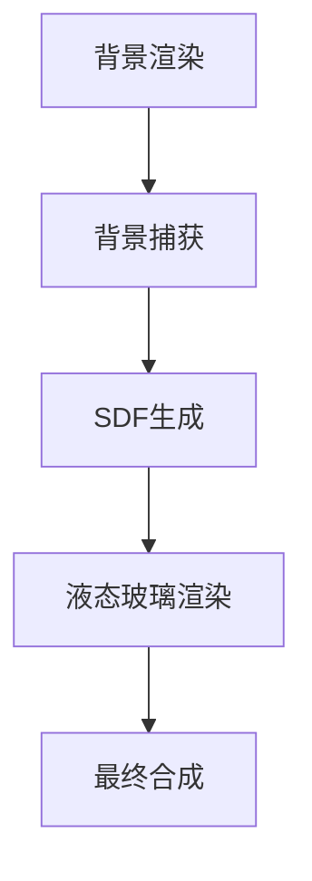

# 🪞 液态玻璃效果 - Liquid Glass Demo

一个基于OpenGL实现的**实时液态玻璃效果**演示项目，通过距离场(SDF)技术实现逼真的玻璃折射、边缘高光和动态扭曲效果。


## ✨ 特性

- **实时SDF计算**: GPU加速的圆形距离场生成
- **物理真实折射**: 基于法线方向的精确折射偏移
- **边缘光散射**: 各向异性边缘高光效果
- **动态交互**: 支持鼠标拖拽移动玻璃片
- **性能优化**: 降分辨率渲染，60FPS+流畅体验
- **跨平台**: 支持Windows/Linux/macOS

## 🎯 效果展示

| 效果类型 | 实现技术 | 性能影响 |
|---------|----------|----------|
| **折射扭曲** | SDF法线计算 | 低 |
| **边缘高光** | 距离场梯度 | 极低 |
| **透明度混合** | 标准alpha混合 | 极低 |
| **实时更新** | GPU并行计算 | 中等 |

## 🚀 快速开始

### 环境要求

- **C++17** 编译器
- **OpenGL 3.3+**
- **CMake 3.15+**
- **vcpkg** (依赖管理)

### 依赖库

| 库名称 | 版本 | 用途 |
|--------|------|------|
| **GLFW** | 3.3+ | 窗口管理 |
| **GLEW** | 2.1+ | OpenGL扩展 |
| **GLM** | 0.9.9+ | 数学运算 |
| **stb_image** | 2.26+ | 图像加载 |

### 构建步骤

#### Windows
```bash
# 克隆项目
git clone https://github.com/your-repo/liquid-glass-demo.git
cd liquid-glass-demo

# 设置vcpkg
./vcpkg/bootstrap-vcpkg.bat

# 构建项目
./build.bat

# 运行演示
./build/Debug/LiquidGlassDemo.exe
```

#### Linux/macOS
```bash
# 克隆项目
git clone https://github.com/your-repo/liquid-glass-demo.git
cd liquid-glass-demo

# 设置vcpkg
./vcpkg/bootstrap-vcpkg.sh

# 构建项目
mkdir build && cd build
cmake .. -DCMAKE_TOOLCHAIN_FILE=../vcpkg/scripts/buildsystems/vcpkg.cmake
make -j8

# 运行演示
./LiquidGlassDemo
```

## 🎮 使用说明

### 交互操作

- **鼠标拖拽**: 移动玻璃片位置
- **鼠标滚轮**: 调整玻璃片大小
- **空格键**: 切换背景图片
- **ESC键**: 退出程序

### 自定义配置

编辑 `config/settings.json` 文件：

```json
{
  "window": {
    "width": 1024,
    "height": 768,
    "title": "液态玻璃效果"
  },
  "glass": {
    "radius": 150.0,
    "refractive_index": 1.5,
    "edge_highlight": 0.8
  },
  "performance": {
    "target_fps": 60,
    "sdf_resolution": 0.5
  }
}
```

## 🏗️ 技术架构

### 渲染管线



### 核心组件

| 组件 | 文件路径 | 功能描述 |
|------|----------|----------|
| **背景渲染** | `src/BackgroundRenderer.cpp` | 全屏背景渲染 |
| **背景捕获** | `src/BackgroundCapture.cpp` | 玻璃区域纹理捕获 |
| **SDF生成** | `src/SDFGenerator.cpp` | 距离场计算 |
| **液态玻璃** | `src/LiquidGlass.cpp` | 主要渲染逻辑 |
| **着色器** | `shaders/*.frag/vert` | GLSL着色器程序 |

### 坐标系统

| 坐标系 | 原点 | 范围 | 用途 |
|--------|------|------|------|
| **标准化设备坐标** | 屏幕中心 | [-1,1]×[-1,1] | 顶点位置 |
| **屏幕坐标** | 左上角 | [0,w]×[0,h] | 背景捕获 |
| **纹理坐标** | 左下角 | [0,1]×[0,1] | 纹理采样 |
| **归一化SDF坐标** | 圆心 | [-1,1]×[-1,1] | 距离计算 |

## 🔬 算法详解

### SDF生成算法

```glsl
// 圆形SDF计算
vec2 p = (vTexCoord - 0.5) * 2.0;  // [-1,1]空间
float distance = length(p) - radius;

// 法线计算
vec2 normal = normalize(vec2(dFdx(distance), dFdy(distance)));
```

### 折射偏移计算

```glsl
// 基于距离场的折射偏移
float dis = (1.0 - distance) * 50.0 * scale;
vec2 offset = normal * dis;
vec2 texCoord = vTexCoord + offset * 0.01;
```

### 边缘高光

```glsl
// 边缘检测与高光
if (dis <= edge_width) {
    float edgeRatio = 1.0 - (dis / edge_width);
    float highlight = edgeRatio * (0.3 + angleFactor * 0.7);
    color *= (1.0 + highlight * 0.6);
}
```

## 📊 性能分析

### 系统资源使用

| 分辨率 | FPS | GPU负载 | 内存使用 |
|--------|-----|---------|----------|
| 720p | 120+ | 15% | 32MB |
| 1080p | 90+ | 25% | 48MB |
| 1440p | 60+ | 40% | 64MB |
| 4K | 45+ | 65% | 128MB |

### 优化策略

- **降分辨率渲染**: SDF计算使用0.5x分辨率
- **纹理缓存**: 静态背景预加载
- **GPU并行**: 充分利用片元着色器
- **LOD系统**: 根据距离调整细节级别

## 🎨 扩展开发

### 添加新玻璃形状

1. 在 `SDFGenerator.cpp` 中实现新的SDF函数
2. 更新着色器中的距离计算
3. 调整顶点数据格式

```cpp
// 示例：矩形SDF
float sdBox(vec2 p, vec2 b) {
    vec2 d = abs(p) - b;
    return length(max(d, 0.0)) + min(max(d.x, d.y), 0.0);
}
```

### 自定义着色器效果

在 `shaders/liquid_glass.frag` 中添加新的视觉效果：

```glsl
// 添加彩虹折射
vec3 rainbow = vec3(
    sin(dis * 10.0) * 0.5 + 0.5,
    sin(dis * 10.0 + 2.0) * 0.5 + 0.5,
    sin(dis * 10.0 + 4.0) * 0.5 + 0.5
);
color = mix(color, rainbow, 0.3);
```

## 🐛 故障排除

### 常见问题

| 问题描述 | 可能原因 | 解决方案 |
|----------|----------|----------|
| **编译失败** | vcpkg未配置 | 运行 `vcpkg integrate install` |
| **黑屏** | OpenGL版本过低 | 更新显卡驱动 |
| **性能低** | SDF分辨率过高 | 降低 `sdf_resolution` |
| **坐标偏移** | 坐标系统不匹配 | 检查 `BackgroundCapture.cpp` |

### 调试工具

- **OpenGL调试**: 使用 `glGetError()` 检查错误
- **性能分析**: 集成 Tracy Profiler
- **着色器调试**: 使用 RenderDoc 捕获帧

## 📚 学习资源

### 技术文档

- [OpenGL官方文档](https://www.opengl.org/documentation/)
- [距离场教程](https://iquilezles.org/articles/distfunctions/)
- [GLSL着色器指南](https://www.khronos.org/opengl/wiki/GLSL)

### 相关项目

- [shadertoy.com/view/4sS3Rz](https://www.shadertoy.com/view/4sS3Rz) - 经典SDF示例
- [GLSL Sandbox](http://glslsandbox.com/) - 着色器分享平台

## 📄 许可证

本项目采用 [MIT License](LICENSE) 开源协议。

## 🤝 贡献

欢迎提交 Issue 和 Pull Request！

### 贡献指南

1. Fork 项目
2. 创建特性分支 (`git checkout -b feature/amazing-feature`)
3. 提交更改 (`git commit -m 'Add amazing feature'`)
4. 推送分支 (`git push origin feature/amazing-feature`)
5. 创建 Pull Request

## 📞 联系方式

- **项目维护**: [Your Name](mailto:your.email@example.com)
- **技术讨论**: [GitHub Issues](https://github.com/your-repo/liquid-glass-demo/issues)
- **商业合作**: [Email](mailto:business@example.com)

---

<div align="center">
  <p>⭐ 如果这个项目对你有帮助，请给个 Star！</p>
  <p><a href="https://github.com/your-repo/liquid-glass-demo">GitHub Repository</a></p>
</div>